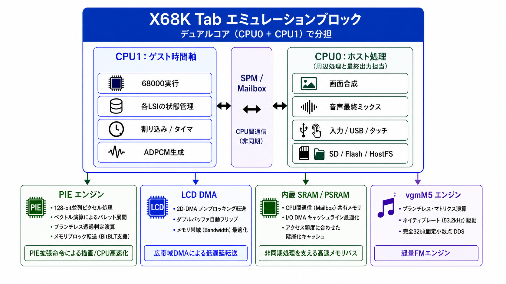

# X68K Tab

[**English README → README_en.md**](README_en.md)

<p align="center">
  
</p>

<p align="center">
  <b>X68000 Emulator for M5Stack Tab5 / ESP32-P4</b><br>
  Developed by Layer812 &nbsp;|&nbsp; Based on PX68K &nbsp;|&nbsp; 68000 core: Musashi
</p>

## 最新版 — Build 6.15 Production

**Build 6.15** は、ここまでの CPU / 描画 / マルチコア高速化をまとめた Production 版です。

- 68000 実行の native-loop JIT / hot-path 高速化
- CPU1（X68000 時間軸）と CPU0（画面・音声・入出力）の役割分離
- G + BG + TEXT の CPU0 合成
- 大きな背景を毎フレーム作り直さない **GRP8 Scroll Cache**
- PIE / XespV による copy / diff / blend 等の高速化
- PSRAM 転送用 AXI-GDMA fallback
- LCD の dirty / diff 更新と CRTC ベースの Frame Pacing
- FM + ADPCM 最終ミックスの CPU0 化

特にスクロール背景は、毎走査線ごとに GVRAM から再生成する方式から、**一度展開した背景をキャッシュし、スクロール位置だけを動かす方式**へ変更しました。  
予定していた高速化だけでなく、開発途中で見つかった「そもそも同じ絵を何度も作らない」という思いがけない高速化も入っています。 :)

---

## X68K Tab とは

**X68K Tab** は、M5Stack Tab5（ESP32-P4）上で SHARP X68000 環境を動作させるための、ポータブル X68000 エミュレータです。

PX68K をベースにしながら、ESP32-P4 のデュアルコア、内蔵 SRAM / PSRAM、LCD DMA、PIE 系の高速ピクセル処理、USB Host、タッチパネル、microSD、内蔵オーディオなど、Tab5 のハードウェアをできるだけ直接活用する方向で移植・再構成しています。

目標は単に「PX68K を ESP32-P4 でコンパイルする」ことではありません。

X68000 側の時間を進める処理と、画面・音声・入力・ストレージといったホスト側処理を分離し、さらに描画、メモリ転送、FM 音源生成などを ESP32-P4 向けに最適化することで、組み込み機器の制約の中でも **X68000 らしい動作感を保ちながら軽快に動かす** ことを目指しています。

> [!IMPORTANT]
> X68K Tab は現在も開発中です。  
> 動かないソフト、表示がおかしいソフト、音が違うソフト、USB 機器との相性、再現性の低い不具合などもまだあると思います。  
> 見つけた場合は、**どうか優しく教えてください**。再現方法やログを添えていただけると、とても助かります。

---

## まず動かしてみる — M5Burner

現在、X68K Tab は **M5Burner** から書き込める形で公開する予定です。

- [M5Burner 公式ページ](https://docs.m5stack.com/ja/uiflow/m5burner/intro)
- [M5Stack 公式ダウンロードページ](https://docs.m5stack.com/ja/download)

### M5Burner Share Code

```text
aFmGCMA3FSvzcW5H
```

M5Burner の **Share Burn** から上記 Share Code を入力し、X68K Tab を選択して Tab5 へ書き込んでください。

### 動作デモ

実機での動作はこちらでご覧いただけます。

- [**X68K Tab 動作デモ（X / @Layer812）**](https://x.com/layer812/status/2089625598687891632)

> [!NOTE]
> M5Burner の画面や操作方法は更新されることがあります。  
> うまく見つからない場合は、上記の M5Stack 公式 M5Burner ページをご確認ください。

---

## 動作させるために必要なもの

### 必須

1. **M5Stack Tab5**
   - [スイッチサイエンス — M5Stack Tab5](https://www.switch-science.com/products/10378?srsltid=AfmBOopIt1INmIhMRAXhtiFCXr5tpOTlYbk1PrGmT6RofG3pSM1ouiow)
   - [M5Stack Tab5 公式ドキュメント](https://docs.m5stack.com/ja/core/Tab5)

2. **microSD カード**
   - X68000 のディスクイメージやユーザーデータを格納します。

3. **動かしたい X68000 ソフトウェア**
   - FDD イメージ: `XDF`, `DIM`
   - HDD イメージ: `HDS`
   - その他、X68K Tab が対応する X68000 用データ

各ソフトウェア、ゲーム、OS、ディスクイメージの著作権および利用条件は、それぞれの権利者に帰属します。  
ご自身が利用する権利を持つデータ、または適切に公開・配布されているデータをご利用ください。

### あると便利

- **USB キーボード**
- **USB Joypad / Gamepad**
- USB マウスなどの対応機器

Tab5 の USB Host を利用して、USB キーボードや Joypad を X68000 の入力として利用できるようにしています。  
タッチパネル上のオンスクリーン UI も利用できます。

---

## CGROM について

X68K Tab では、X68000 実機から吸い出したオリジナルの CGROM データをそのまま配布するのではなく、**再配布可能なフリーフォントから CGROM 互換データを生成する方法**を採用しています。

リポジトリのルートには、CGROM データを生成するための [`build_cgrom.py`](build_cgrom.py) を置いています。

これにより、文字表示に必要なデータを用意しつつ、オリジナル機の CGROM イメージそのものを配布しない構成にしています。

使用するフォントについては、そのフォント自身のライセンス条件に従ってください。

その他の ROM、OS、システムソフトウェアについても、それぞれの著作権者・配布元の条件に従ってください。

---

## X68K Tab が生まれた経緯 — PanicPlayer から

このプロジェクトは、最初から「X68000 エミュレータを作ろう」と始めたものではありません。

もともとは、昔の X68000 **PANIC** データを M5Stack Tab5 で再生したくなり、専用プレイヤー **[PanicPlayerTab5](https://github.com/Layer812/PanicPlayerTab5)** を作っていました。

PANIC を再生するために必要な X68000 互換環境を少しずつ実装していったのですが、問題がひとつありました。

**肝心の PANIC データが、なかなか集まりませんでした。**

一方で、PANIC を動かすために作っていた X68000 互換部分は、

- 68000 CPU
- メモリ
- 割り込み / タイマ
- グラフィック
- スプライト
- FM 音源
- ADPCM
- FDD / HDD
- USB 入力
- Human68k 起動

PANIC データがなかなか集まらない中、PanicPlayer 向けの X68000 互換機能をコツコツ作っていたら……

**いつの間にか X68000 エミュレータができていました。**

それを独立したプロジェクトとして切り出したのが **X68K Tab** です。

PanicPlayerTab5 も引き続き大切なプロジェクトです。

もし昔の HDD、MO、CD-R、バックアップなどに `.PAN` ファイルや PANIC 関連データが残っていましたら、情報だけでも歓迎です。  
PANIC データをいただけると、作者のモチベーションがかなり上がります。 :)

---

## 主な特徴

- M5Stack Tab5 / ESP32-P4 専用設計
- PX68K をベースにした X68000 エミュレーション
- Musashi 68000 CPU core
- ESP32-P4 デュアルコアを利用した役割分担
- CPU1: X68000 のゲスト時間軸を優先
- CPU0: 画面、音声、入力、ストレージなどのホスト処理
- CPU 間は SPM / Mailbox を意識した非同期通信
- PIE / XespV を利用した描画・メモリ処理の高速化
- 68000 native-loop JIT / hot-path 高速化
- G + BG + TEXT の CPU0 合成
- GRP8 Scroll Cache による背景スクロール高速化
- dirty / diff + Frame Pacing を使った LCD 表示
- LCD DMA による画面転送
- vgmM5 系 YM2151 バックエンド
- ADPCM
- microSD / Flash / HostFS
- XDF / DIM / HDS
- USB Keyboard / Joypad
- タッチ UI
- Human68k 起動
- ゲスト環境だけをリセットし、ホスト側サービスを維持する再起動経路
- ESP32-P4 向けの継続的な高速化

---

## アーキテクチャ

<p align="center">
  
</p>

X68K Tab の大きな特徴は、X68000 エミュレーションをひとつの巨大なループへ押し込めず、ESP32-P4 の 2 コアを役割ごとに分けていることです。

### CPU1 — Guest Timing Domain

CPU1 は、X68000 側から見た「時間」をできるだけ安定して進めることを担当します。

主な処理:

- 68000 実行
- 各 LSI の状態管理
- 割り込み
- タイマ
- ゲスト側 DMA イベント
- ADPCM 生成
- X68000 側のサイクル進行

画面転送や USB 処理が重くなったときに 68000 の実行まで不規則に止まらないよう、ゲスト側の時間軸をホスト処理からなるべく独立させます。

### CPU0 — Host Processing

CPU0 は Tab5 側の処理と最終出力を担当します。

- 画面合成
- LCD 出力
- FM 音源処理
- FM + ADPCM の最終ミックス
- USB Host
- キーボード / Joypad / タッチ
- SD / Flash / HostFS
- ホスト UI
- M5Stack / ESP-IDF 周辺処理

CPU1 が X68000 の時間を進めることに集中し、CPU0 が現代側の入出力を引き受ける構成です。

### SPM / Mailbox — 非同期 CPU 間通信

CPU0 と CPU1 の間では、大きな同期ロックをできるだけ避け、Mailbox 的なメッセージと共有バッファを利用します。

重要なのは、

**CPU0 の処理が一時的に遅れても、CPU1 のゲスト時間軸を必要以上に止めないこと**

です。

映像、音声、入力、メディア変更なども、可能なものから非同期 producer / consumer 型へ移行しています。

---

## ESP32-P4 を使った高速化

X68K Tab では「クロックを上げる」だけではなく、処理の形そのものを ESP32-P4 に合わせることを重視しています。

### PIE / XespV

描画や大量データ処理では、ESP32-P4 の PIE / XespV 系高速処理を利用しています。

6.15 で実際に使用している主な対象:

- 128-bit 並列処理
- copy / fill
- key-color / blend
- diff
- RGB565 系ピクセル処理
- raster snapshot
- メモリブロック処理

PIE は 68000 命令そのものを置き換える用途ではなく、描画・変換・比較・メモリ処理など、**エミュレーション周辺の大量データ処理を高速化するアクセラレータ**として使用しています。

高速経路は起動時 self-check や reference path との比較を行い、結果が一致するものを採用し、条件に合わない場合は C / scalar 実装へ fallback します。

### 68000 native-loop JIT

6.15 では Musashi の通常実行を基準として、実ゲーム中で効果が確認できた小さなループや hot path を ESP32-P4 の RV32 native code へ変換する方式を採用しています。

- 32 KiB executable arena
- TCM / internal SRAM の dispatch cache
- direct L0 lookup / epoch memo
- 小規模 loop fragment
- signature / RAM guard
- unsupported path は即座に Musashi へ fallback

互換性を優先し、巨大な全面 JIT ではなく **安全に効く部分だけを native 化する補助 JIT** という位置付けです。

### Render / Scroll Cache

6.15 では、Graphics / BG / TEXT を CPU1 だけで最終合成する方式から、対応する 256 色モードで CPU0 に最終 G + BG + TEXT 合成を渡す経路を追加しています。

さらに、大きな一枚絵をスクロールさせるような画面では、GRP8 を毎フレーム GVRAM から作り直すのではなく、**512 x 512 の palette-index Scroll Cache** を保持します。

GVRAM が実際に書き換えられた行だけを再構築し、単なるスクロールでは既存キャッシュを再利用するため、PSRAM 転送量とフレームごとの処理量の揺れを大きく減らせます。

### LCD DMA

完成したフレームを CPU が逐次 LCD へ送るのではなく、DMA 転送へ渡します。

- 2D-DMA / non-blocking transfer
- double buffer
- automatic frame flip
- CPU と LCD 転送の並列化
- memory bandwidth optimization

CPU が LCD 転送完了を待つ時間を減らし、次のフレーム処理と表示転送を重ねることを目指します。

### 内蔵 SRAM / PSRAM

Tab5 のメモリは用途ごとに使い分けます。

- internal SRAM: 頻繁にアクセスする小さな working set
- PSRAM: VRAM、framebuffer、大きなバッファ
- SPM / Mailbox: CPU 間の通知・共有情報
- scratch buffer: 音声や変換処理の一時領域

6.15 では、cache-line alignment、hot table の SRAM 配置、CPU 間コピー削減、PSRAM の大容量バッファ利用などをすでに複数の経路で採用しています。

今後は、効果が実測できる箇所に絞って burst access、DMA-friendly layout、階層化キャッシュの適用範囲を広げます。

---

## サウンド — vgmM5 / YM2151 / ADPCM

X68000 にとって音は非常に重要です。

X68K Tab では、単に「鳴ればよい」ではなく、YM2151 の時間軸、FM の質感、ADPCM との関係をなるべく崩さず、そのうえで ESP32-P4 上で軽量に動作することを目標にしています。

### [vgmM5 エンジン](https://github.com/Layer812/vgmM5)

FM 音源は [vgmM5](https://github.com/Layer812/vgmM5) 系の YM2151 バックエンドを利用し、ESP32-P4 向けの軽量化を進めています。

現在および今後の高速化テーマ:

- branchless matrix operation
- complete 32-bit fixed-point DDS
- native-rate generation
- 約 53.2 kHz 系の YM2151 native-rate path
- FM 演算の負荷削減
- PSRAM アクセス削減
- FM / ADPCM mixer 最適化
- resampling cost 削減
- audio buffer latency 削減
- underflow recovery 改善

目標は **高精度でありながら軽量な FM エンジン** です。

### ADPCM

ADPCM はゲスト側時間軸との結び付きが強いため、CPU1 側で生成し、CPU0 側で FM と最終ミックスする構成を基本にしています。

生成と最終出力を分離することで、オーディオ処理が一時的に重くなっても 68000 実行への影響を抑えます。

---

## ストレージ / 起動

現在、次のようなメディアと起動経路を対象にしています。

- `XDF`
- `DIM`
- `HDS`
- microSD
- Flash
- HostFS
- Human68k
- FDD boot
- HDD boot

Flash 側の起動環境と SD 側のユーザーデータを分離し、ポータブル機として使いやすい構成も開発しています。

また、ランチャーからメディアを切り替える際には ESP32-P4 全体を再起動するのではなく、可能な限り **X68000 のゲスト環境だけを再初期化**し、LCD、USB、音声などのホスト側サービスを生かしたまま切り替える方向で実装しています。

---

## 入力

対応・開発対象:

- Tab5 capacitive touch
- on-screen UI
- USB keyboard
- USB Joypad / Gamepad
- USB mouse

ゲームによって必要となるキーや Joypad 操作が異なるため、キーエイリアスや操作 UI も順次改善しています。

---

## 現在の開発状況

2026 年 8 月時点では、X68K Tab は **RC 相当の開発段階**です。

| Area | Status |
|---|---|
| IPL / Human68k boot | Working / testing |
| FDD XDF / DIM | Working / testing |
| HDD / HDS | Working / testing |
| Flash boot | Working / testing |
| HostFS / SD | Working / testing |
| Guest-only reboot / media switching | Working / regression testing |
| Graphic VRAM | Working / Build 6.15 accelerated paths active |
| Text / BG / Sprite composition | Working / CPU0 G+BG+TEXT path + scroll cache active |
| LCD output / DMA | Working / dirty-diff + frame pacing active |
| YM2151 FM / vgmM5 | Working / optimization ongoing |
| 32-bit DDS / native-rate FM | In progress |
| ADPCM | Working |
| FM + ADPCM mix | Working / tuning ongoing |
| USB keyboard | Working / testing |
| USB Joypad | Working / compatibility testing |
| Touch UI | Working / evolving |
| PIE / XespV acceleration | Working on selected validated paths |
| Stability | Continuous regression testing |

X68000 は、ソフトウェアごとにハードウェアの使い方が大きく違います。

「Human68k が起動した」ことと「すべての X68000 ソフトが完全互換で動く」ことは別です。

そのため、ひとつのゲームやデモだけで起きる不具合も重要な互換性情報になります。

---

## 高速化の進捗と今後

6.15 で、当初予定していた「ESP32-P4 向けの大きな高速化フェーズ」はいったん完了としています。

### 6.15 までに実装したもの

#### CPU / Bus

- Musashi を基準とした 68000 実行
- instruction dispatch hot-path
- TCM / internal SRAM dispatch cache
- native-loop JIT
- poll / DBcc / branch / memory operation の限定 fast-path
- guest timing と host 処理の分離
- CPU1 の WDT / idle relief 調整

#### Graphics / Render

- PIE / XespV の copy / fill / diff / blend
- dirty row / pixel-diff LCD 更新
- CPU0 G + BG + TEXT compositor
- GRP8 shared-scroll path の CPU0 化
- **512 x 512 persistent Scroll Cache**
- GVRAM 更新行だけの cache invalidation / rebuild
- AXI-GDMA による PSRAM transfer fallback
- C / scalar fallback を残した安全な高速経路

#### Multi-core

- CPU1: 68000 / guest timing / ADPCM generation
- CPU0: compositor / LCD / USB / FM / final audio mix
- SPM / Mailbox を使った通知
- producer / consumer 型の非同期処理
- CPU1 を LCD 転送からできるだけ独立

#### LCD

- 4:3 viewport
- generation-dirty row tracking
- PIE-DIFF による pixel-identical row suppression
- dirty band 更新
- **CRTC ベース Frame Pacing**
- 最新フレーム優先の表示

#### Audio

- ADPCM generation と final output の分離
- YM2151 の CPU0 backend
- FM + ADPCM final mix の CPU0 化
- jitter buffer / underflow recovery
- pitch-safe 44.1 / 22.05 kHz pressure relief

### 思いがけず効いた高速化

当初は「GVRAM の転送や合成をもっと速くする」方向を中心に考えていました。

しかし実機で大きな背景スクロールを追いかけた結果、

> **同じ背景を速く作り直すより、そもそも作り直さない方が速い**

という当たり前だけれど強力な結論にたどり着きました。

6.15 の Scroll Cache は、背景を palette-index のまま保持し、スクロール時には source offset だけを変更します。  
これは今回の高速化フェーズで特に効果の大きかった変更のひとつです。

### 今後

以後は「高速化のための高速化」はいったん止め、**互換性・安定性・対応ソフトの拡大を優先**します。

性能面で今後検討する候補は次のとおりです。

- 65K color mode の重い GRP generation
- Sprite / BG generation のさらなる CPU0 / PIE 化
- vgmM5 の 32-bit fixed-point DDS / native-rate YM2151
- PSRAM bandwidth を増やさない範囲での PPA 利用
- LCD presentation / DMA の追加改善
- 実ゲームで明確なボトルネックが見つかった場合の targeted optimization

**効果が測れない高速化は採用せず、互換性を壊さないことを最優先にします。**

---

## ビルド

開発環境は PlatformIO + ESP-IDF / M5Unified 系です。

### ビルド前に `human302.xdf` を配置してください

ソースからビルドする場合は、**リポジトリのルートに `human302.xdf` を配置してから**ビルドしてください。

```text
X68K-Tab/
├── human302.xdf        ← ローカルに用意（GitHub には含めません）
├── build_cgrom.py
├── LICENSE_SHARP_X68000.txt
├── platformio.ini
├── src/
└── components/
```

`human302.xdf` は GitHub リポジトリには収録せず、`.gitignore` の対象としています。  
ビルドに使用する Human68k 関連ソフトウェアは、SHARP の公開条件・使用許諾に従って各自で用意してください。適用される条件については [`LICENSE_SHARP_X68000.txt`](LICENSE_SHARP_X68000.txt) を参照してください。

CGROM については、ルートの [`build_cgrom.py`](build_cgrom.py) を使って再配布可能なフォントから生成する構成です。

準備ができたら通常どおりビルドします。

```bash
pio run -e m5stack-tab5
```

書き込み:

```bash
pio run -e m5stack-tab5 -t upload
```

シリアルモニタ:

```bash
pio device monitor -b 115200
```

開発中のため、ESP-IDF / M5Unified / PlatformIO の推奨バージョンやメモリ配置は変更される可能性があります。

M5Burner 版は、ソースからビルドせず試したい方向けのもっとも簡単な導入方法です。

---

## ソフトウェア / ROM / ディスクイメージについて

X68K Tab は、市販ゲームや第三者のソフトウェアを無断配布するためのプロジェクトではありません。

X68000 のゲーム、アプリケーション、ディスクイメージ、ROM、OS、データなどの著作権は、それぞれの権利者に帰属します。

利用するソフトウェアについては、それぞれの配布条件・使用許諾に従ってください。

CGROM については前述のとおり、オリジナル CGROM を配布する代わりに、フリーフォントから互換データを生成する方法を採用しています。

---

# 著作権・ライセンス・謝辞

X68K Tab は、長年にわたる X68000 エミュレーション技術、解析資料、オープンソース実装、そして ESP32 / M5Stack エコシステムの上に成り立っています。

先人の皆様に深く感謝します。

第三者ソフトウェアや個別ライセンスの詳細は、以下も参照してください。

- [**THIRD_PARTY_NOTICES.md**](THIRD_PARTY_NOTICES.md)
- [**LICENSE_SHARP_X68000.txt**](LICENSE_SHARP_X68000.txt)
- [**LICENSE_PANIC_X.txt**](LICENSE_PANIC_X.txt)
- [**PANIC_V1.38_NOTICE.txt**](PANIC_V1.38_NOTICE.txt)

## SHARP X68000

X68000 はシャープ株式会社が開発したコンピュータです。

X68K Tab では、シャープ・プロダクツ・ユーザーズ・フォーラム（FSHARP）を通して無償公開された X68000 用システムソフトウェアを利用する場合があります。

それらを利用・収録・再配布する場合は、当時公開された使用許諾条件に従います。

適用されるオリジナルの許諾文は、本リポジトリの以下のファイルへ原文のまま収録してください。

```text
LICENSE_SHARP_X68000.txt
```

SHARP 由来ソフトウェアの使用・複製・改変・再配布条件については、この README の要約ではなく **必ずオリジナルの許諾文を優先して参照してください**。

参考:

- [X68000 LIBRARY - SHARP ソフトウェア](https://retropc.net/x68000/software/sharp/)

SHARP、X68000、および関連するソフトウェア、名称、商標等の権利は、シャープ株式会社および各権利者に帰属します。

**X68K Tab は個人による非公式プロジェクトであり、シャープ株式会社とは関係なく、同社による承認・協賛を受けたものではありません。**

## PANIC / panic.x V1.38

X68K Tab には、PanicPlayerTab5 から引き継いだ **PANIC Player** 機能があり、再生環境としてオリジナルの `panic.x` V1.38 を組み込んでいます。

PANIC は **Hideya Nagata（pako / ぱこたん / 永田英哉）** 氏によって作成され、`panic.x` V1.38 は pako 氏の V1.34 をベースに **Nashimi（なしみ）** 氏による変更を含むものとして配布されています。PANIC の著作権は、オリジナル配布ドキュメントの記載どおり pako 氏に帰属します。

PanicPlayerTab5 で保存しているオリジナル V1.38 配布ドキュメントでは、PANIC について **使用・再配布・改変・商用利用が許可**されています。ただし、この README は原文の代替ではありません。公開・再配布時にはオリジナル配布ドキュメントを優先してください。

- [**PANIC.X ライセンス／再配布表示 — LICENSE_PANIC_X.txt**](LICENSE_PANIC_X.txt)
- [**PANIC V1.38 notice — PANIC_V1.38_NOTICE.txt**](PANIC_V1.38_NOTICE.txt)
- [PanicPlayerTab5](https://github.com/Layer812/PanicPlayerTab5)
- [X68000 LIBRARY - PANIC](https://retropc.net/x68000/software/movie/panic/panic/)

なお、`.PAN` データは PANIC.X 本体とは別の著作物です。個々の `.PAN` ファイルの著作権・再配布条件は、それぞれの作者に帰属します。

## PX68K

X68K Tab は **PX68K** をベースとして M5Stack Tab5 / ESP32-P4 へ移植・再構成しているプロジェクトです。

PX68K は、WinX68k、xkeropi などへ続く長い X68000 エミュレータ開発の系譜を受け継いでいます。

hissorii さんをはじめ、PX68K、WinX68k、xkeropi の開発、移植、解析、資料整備に関わった皆様に感謝します。

- [PX68K](https://github.com/hissorii/px68k)

PX68K および upstream 由来のコードには、それぞれの著作権表示・ライセンス・配布条件が適用されます。  
第三者コードの copyright / license header は削除しないでください。

## Musashi

X68K Tab では 68000 CPU エミュレーションコアとして **Musashi** を利用しています。

Karl Stenerud さん、および Musashi の開発に関わった皆様に感謝します。

- [Musashi](https://github.com/kstenerud/Musashi)

Musashi 由来コードの著作権表示・許諾条件は `THIRD_PARTY_NOTICES.md` 等へ収録してください。

## [vgmM5](https://github.com/Layer812/vgmM5) / YM2151

FM 音源処理では、Layer812 が別プロジェクトとして開発している [vgmM5](https://github.com/Layer812/vgmM5) の YM2151 実装を X68K Tab 向けに統合・最適化しています。

X68K Tab では、vgmM5 の固定小数点 FM エンジンや高速化の考え方をベースに、X68000 / PX68K 側のタイマ・ステータス・IRQ の挙動と組み合わせています。

vgmM5 由来コードの詳細は [**THIRD_PARTY_NOTICES.md**](THIRD_PARTY_NOTICES.md) および `components/px68k/fmgen/VGMM5_YM2151_NOTICE.md` を参照してください。

## M5Stack

M5Stack、M5Stack Tab5、M5Burner、M5Unified、M5GFX および関連名称は M5Stack Technology Co., Ltd. の製品・プロジェクトです。

X68K Tab は M5Stack とは独立した非公式プロジェクトです。

- [M5Stack Tab5](https://docs.m5stack.com/ja/core/Tab5)
- [M5Burner](https://docs.m5stack.com/ja/uiflow/m5burner/intro)
- [M5Unified](https://github.com/m5stack/M5Unified)

## Espressif

ESP32-P4、ESP-IDF および関連技術を開発・公開している Espressif Systems に感謝します。

X68K Tab では ESP32-P4 のデュアルコア、DMA、メモリシステム、LCD 周辺機能などを積極的に利用しています。

---

## このリポジトリのライセンスについて

X68K Tab は複数の upstream ソフトウェアを含む／参照するため、**リポジトリ内のすべてのファイルへ単一ライセンスが一律に適用されるとは限りません**。

公開時には、少なくとも次のような整理を推奨します。

```text
LICENSE
LICENSE_SHARP_X68000.txt
LICENSE_PANIC_X.txt
PANIC_V1.38_NOTICE.txt
THIRD_PARTY_NOTICES.md
```

- X68K Tab 固有の新規コード: `LICENSE`
- PX68K / WinX68k / xkeropi 等の upstream 由来コード: 各 upstream / 各ファイルの条件
- SHARP 公開ソフトウェア: `LICENSE_SHARP_X68000.txt`
- PANIC / panic.x V1.38: `LICENSE_PANIC_X.txt` / `PANIC_V1.38_NOTICE.txt`
- Musashi / vgmM5 / その他ライブラリ: 各ライブラリのライセンス
- CGROM 生成に使用するフォント: 各フォントのライセンス

実際に公開するソースと配布バイナリを基準として `THIRD_PARTY_NOTICES.md` を確認してください。

---

## バグ報告・動作報告・Issue

動作報告は大歓迎です。

特に次の情報があると解析しやすくなります。

- 使用したソフト / ゲーム / デモ
- XDF / DIM / HDS などメディア形式
- 起動方法
- 発生した症状
- 再現手順
- シリアルログ
- 可能であれば画面写真 / 動画
- USB デバイスの場合は製品名

そしてもう一度だけ。

**動かないソフトやバグを見つけたら、どうか優しく教えてください。**

X68000 はソフトごとに本当にいろいろな方法でハードウェアを使っています。  
「この一本だけ変」という報告も、互換性を上げるための大切な情報です。

Issues / Pull Requests も歓迎します。

---

## 更新履歴

### 6.15 — Production

6.12u からの主な変更:

- 68000 実行に **native-loop JIT / hot-path 高速化**を追加
- TCM / internal SRAM を使った dispatch cache を導入
- CPU1 を X68000 の guest timing、CPU0 を画面・音声・入力などの host processing にさらに明確に分離
- G + BG + TEXT の最終合成を CPU0 へ移す高速経路を追加
- 大きな背景用の **512 x 512 GRP8 Scroll Cache** を追加
  - 同じ背景を毎フレーム再生成せず、スクロール位置だけを変更
  - GVRAM が実際に変更された行だけ再構築
- PIE / XespV の copy / fill / diff / blend 高速経路を拡大
- PSRAM 転送に AXI-GDMA を利用できる経路を追加
- LCD の dirty / diff 更新を改善
- **CRTC ベースの Frame Pacing** を追加し、スクロール表示のカクつきを低減
- FM / ADPCM の最終ミックスなど、ホスト側音声処理の CPU0 化を拡大
- 開発用の周期ベンチ／詳細 JIT ログを整理し、Production 構成へ移行

### 6.12u — Initial Public Release

- X68K Tab の最初の公開版
- PANIC / GUI / FILE / F7 / F8 などの切り替えを **ESP32-P4 全体の再起動ではなく guest-only reset** で行う構成へ変更
- LCD / USB / audio などを再初期化せずに X68000 環境を切り替える基本構成を確立
- XDF / DIM / HDS、Human68k、HostFS、USB Keyboard / Joypad、タッチ UI、PANIC Player を統合した公開ベースライン

---

## PANIC データも探しています

X68K Tab は PanicPlayerTab5 から生まれたプロジェクトです。

もし古い HDD、MO、CD-R、バックアップの片隅に、

- `.PAN`
- PANIC 関連の LZH / ZIP
- README / DOC
- BBS のファイル一覧
- ファイル名だけのメモ
- 「昔こんなのを見た」という記憶

などが残っていましたら、情報だけでも大歓迎です。

データそのものの取り扱いは、それぞれの作者・権利者の方針に従ってください。

PANIC データが見つかると、開発者のモチベーションが上がります。かなり上がります。

- [PanicPlayerTab5](https://github.com/Layer812/PanicPlayerTab5)

---

## 最後に

30 年以上前の X68000 を、手のひらサイズの RISC-V マシン上で、当時とはまったく異なるアーキテクチャを使ってもう一度動かす。

CPU1 は X68000 の時間を守り、CPU0 は画面・音・入出力を引き受け、native-loop JIT が 68000 の hot loop を助け、Scroll Cache が同じ背景の再生成を避け、PIE / XespV がピクセル処理を支援し、DMA がデータを運び、vgmM5 が FM 音源を生成する。

**X68K Tab は、X68000 を動かすことと、そのための新しいアーキテクチャを考えることの両方を楽しむプロジェクトです。**
