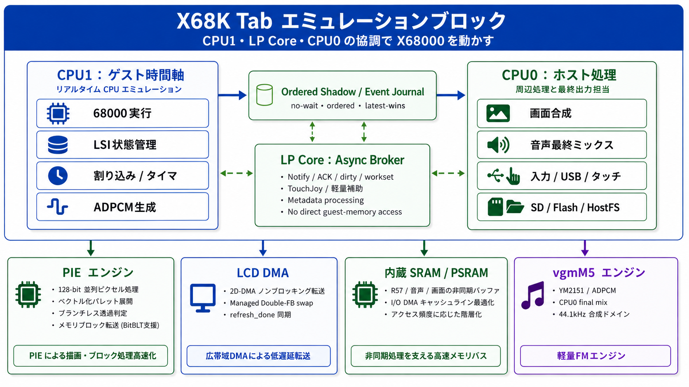

# X68K Tab

[**English README → README_en.md**](README_en.md)

  

  <b>X68000 Emulator for M5Stack Tab5 / ESP32-P4</b> 
  Developed by Layer812 &nbsp;|&nbsp; Based on PX68K &nbsp;|&nbsp; 68000 core: Musashi

## X68K Tab とは

**X68K Tab** は、M5Stack Tab5（ESP32-P4）で動作するポータブル X68000 エミュレータです。

PX68K / Musashi をベースに、ESP32-P4 の 2つの HP CPU、LP Core、PSRAM、MIPI-DSI、USB Host、microSD、内蔵オーディオを活用する構成へ再設計しています。

もともとは、昔の X68000 **PANIC** データを M5Stack Tab5 で再生したくなり、専用プレイヤー [PanicPlayerTab5](https://github.com/Layer812/PanicPlayerTab5) を作ったところから始まりました。

PANIC を再生するために必要な X68000 環境を少しずつ実装していったら...いつの間にか X68000 エミュレータになりました。

今回の更新では、[**MidMod**](https://github.com/Layer812/MidMod) を組み込み、X68000 の MIDI 出力を [**M5Stack Unit Synth (SAM2695)**](https://www.switch-science.com/products/9510) で鳴らせるようにしました。

GS 系の MIDI データについても、MidMod の GS → SAM2695 マッピングを利用して、自然に再生できるよう変換しています。

> [!IMPORTANT]
> すべての X68000 ソフトウェアの完全互換を保証するものではありません。  
> 表示、音声、入力、USB機器、ディスク、MIDIなどで問題を見つけたら、再現方法を添えて Issue で教えてください。

---

## Current Production

現在の Production 版では、**68000 guest CPU を 12 MHz、X68000 peripheral time domain を exact 10 MHz** としています。

今回の主な更新は **MIDI / MidMod / SAM2695 対応**です。

### 2026-10-05 — Tab5 LCD panel compatibility update

M5Stack Tab5 には、出荷時期やハードウェアリビジョンによって **ILI9881C / ST7121 / ST7123** の異なる LCD 構成が存在することが分かっています。

2026-10-04 に行った pixel clock 60 MHz のみの互換性試行では、報告のあった個体の表示問題は解決しませんでした。その後、パネル判定、MIPI-DSI lane rate、pixel clock、porch、frame ACK/BTA、clock-lane 動作、初期化シーケンスを切り分け、パネルごとに互換設定を適用する方式へ更新しました。

**ST7121 搭載 Tab5 については、表示できなかった実機で X68K Tab が正常に動作することを確認できました。** ST7123 は既知良好個体の安定動作を維持する設定を使用し、ILI9881C 向けの互換設定も含めています。

この対応は物理 LCD / MIPI-DSI の初期化・scanout 条件を対象としており、X68000 guest timing、CPU1、DoubleFB / PPA / presenter、MIDI、audio の基本方針は変更していません。

> [!NOTE]
> Tab5 の全製造ロットでの動作を保証するものではありません。表示に問題がある場合は、使用している Tab5 の情報と症状を Issue で教えてください。
>
> **Special thanks to Nochiさん！** ST7121 搭載 Tab5 での実機検証と互換表示対応の確認にご協力いただき、ありがとうございました。

| 項目 | Production 構成 |
| --- | --- |
| Guest CPU | **12 MHz** |
| Peripheral domain | **exact 10 MHz** |
| Guest RAM | **12 MiB** |
| CPU1 | 68000 / guest device time を優先。host-side の都合で待たせない |
| CPU0 | video / LCD / YM2151 / MIDI / final audio mix / USB / storage / host UI |
| Graphics | sparse dirty update |
| Audio | YM2151 + ADPCM |
| Storage | microSD / Flash / HostFS、XDF / DIM / HDS |
| Input | USB Keyboard / Joypad / Mouse + Touch UI |
| MIDI | **YM3802 → MidMod → M5Stack Unit Synth (SAM2695)** |
| GS | **MidMod GS → SAM2695 マッピング** |
| PANIC | Production版では PANIC Player 統合を一旦削除 |

---

## MIDI / MidMod / Unit Synth

今回の更新で、X68000 の MIDI 出力に対応しました。

使用している MIDI 処理ライブラリは、

- [**MidMod — Modifiable MIDI Module**](https://github.com/Layer812/MidMod)

です。

音源は、

- [**M5Stack Unit Synth (SAM2695)**](https://www.switch-science.com/products/9510)

を使用します。

### GS mapping

SAM2695 は Roland SC-55 / SC-88 そのものではないため、GSデータを完全に同じ音色で再生することはできません。

そこで MidMod の GS → SAM2695 マッピングを使い、

> **「そのGSデータがSAM2695だったら、どの音で鳴らすのが自然か」**

という方向でマッピングしています。

マッピングは今後も MidMod 側で改善していく予定です。

X68K Tab 側では `/sdcard/midimap.csv` を置くことで、マッピングプロファイルを差し替えることもできます。

---

## まず試す — M5Burner

- [M5Burner 公式ページ](https://docs.m5stack.com/en/uiflow/m5burner/intro)
- [M5Stack ダウンロード](https://docs.m5stack.com/en/download)

M5Burner の **Share Burn** で Share Code を入力してください。

| バージョン | Share Code | 用途 |
| --- | --- | --- |
| **Latest / Production Release** | `soDETfCXCWpkWT37` | **Tab5 LCD互換対応 + MidMod / SAM2695 MIDI対応版** |

まずはこちらを試してください。

---

## 必要なもの

- [M5Stack Tab5](https://docs.m5stack.com/en/core/Tab5)
- microSD カード
- 正当に利用できる X68000 ソフトウェア / ディスクイメージ
  - FDD: `XDF`, `DIM`
  - HDD: `HDS`

### MIDIを使う場合

- [M5Stack Unit Synth (SAM2695)](https://www.switch-science.com/products/9510)

X68K Tab の PORT.A から MIDI 31,250 bps で接続します。

### 入力機器

- [M5Stack Tab5用キーボード](https://www.switch-science.com/products/11257)
- USB キーボード
- USB Joypad / Gamepad
- USB マウス
- 画面上のタッチ UI / バーチャルキーボード / Joypad

---

## PANIC Player

X68K Tab は [PanicPlayerTab5](https://github.com/Layer812/PanicPlayerTab5) から始まったプロジェクトです。

ただ、肝心の PANIC データがなかなか集まらなかったので（笑）、**Production版では PANIC Player の統合機能を一旦外しました。**

PanicPlayerTab5 自体は別プロジェクトとして残しています。

---

## Display / MULTISCAN

X68K Tab は guest 側の CRTC 状態から **15 kHz / 24 kHz / 31 kHz 系モードを自動判定**し、Tab5 の 1280×720 LCD へ変換して表示します。

X68000 の走査周波数そのものを外部へ出力するものではありません。Tab5 の LCD は固定出力で、guest video mode を内部で変換します。

---

## Audio

YM2151 + ADPCM を ESP32-P4 上で再生します。

host-side の一時的な表示負荷などで guest timeline を不必要に止めないことを優先しています。

---

## ESP32-P4 マルチコア構成

  

- **HP CPU1 — Guest Time Domain**  
  68000、割り込み、タイマ、guest-side DMA、CRTC、audio event など X68000 側の時間を優先して進めます。

- **HP CPU0 — Host Processing**  
  画面合成、LCD、YM2151、MIDI、final audio mix、USB、SD / Flash / HostFS、Touch UI を担当します。

- **LP Core — Lightweight Broker**  
  一部の軽量 notification / metadata / broker 処理を補助します。

中心となる原則は、**host-side の一時的な遅れを理由に CPU1 の guest timeline を不必要に止めないこと**です。

---

## ROM / CGROM / Human68k

本リポジトリには、SHARP X68000 のオリジナル ROM dump、Human68k のディスクイメージ、ユーザー所有の X68000 ソフトウェアを含めません。

CGROM については、オリジナル CGROM dump を再配布するのではなく、`build_cgrom.py` を用意しています。

Human68k 関連ファイルについても、適用される条件に従って各自で正当に用意してください。

詳細:

- `LICENSE_SHARP_X68000.txt`
- `LICENSE_PANIC_X.txt`
- `PANIC_V1.38_NOTICE.txt`
- `THIRD_PARTY_NOTICES.md`

---

## Source Build

現在の Production 基準:

- ESP-IDF 5.5.x
- ESP32-P4 360 MHz
- PSRAM 32 MiB / 200 MHz
- Flash QIO / 80 MHz
- M5Unified / M5GFX
- Musashi
- PX68K
- [MidMod](https://github.com/Layer812/MidMod)

ローカルに必要な ROM / OS / disk image 等はリポジトリへ追加しないでください。

---

## Credits / License

X68K Tab は、多くのエミュレータ、ハードウェア研究、OSS の成果の上に成り立っています。

- PX68K
- Musashi
- vgmM5
- [MidMod](https://github.com/Layer812/MidMod)
- M5Stack / M5Unified / M5GFX
- Espressif ESP32-P4 / ESP-IDF

各ライセンス・third-party notice はリポジトリ内の文書を確認してください。

X68K Tab は個人による非公式プロジェクトです。SHARP、M5Stack その他各権利者の公式・公認・スポンサー製品ではありません。
