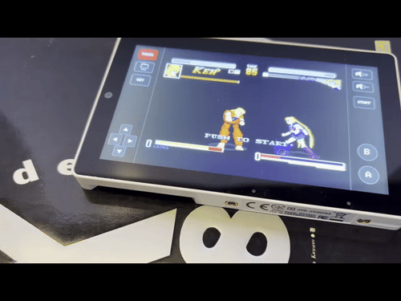
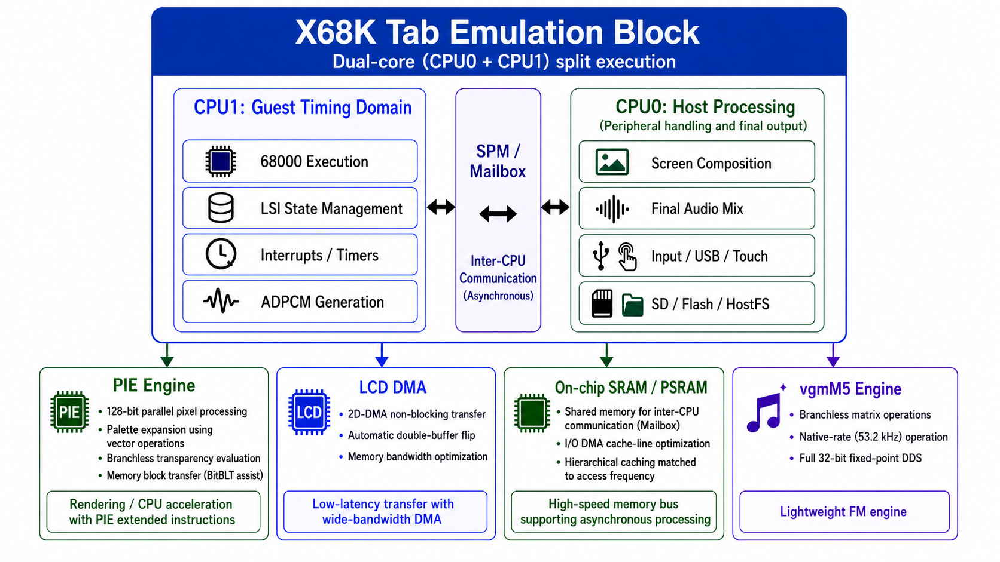

# X68K Tab

[**日本語 README → README.md**](README.md)

<p align="center">
  
</p>

<p align="center">
  <b>X68000 Emulator for M5Stack Tab5 / ESP32-P4</b><br>
  Developed by Layer812 &nbsp;|&nbsp; Based on PX68K &nbsp;|&nbsp; 68000 core: Musashi
</p>

## Latest Release — Build 6.15 Production

**Build 6.15** is the Production release that consolidates the CPU, rendering, and multi-core performance work completed so far.

- native-loop JIT and hot-path acceleration for 68000 execution
- CPU1 dedicated to the X68000 timing domain, with CPU0 handling display, audio, and host I/O
- CPU0-side G + BG + TEXT composition
- persistent **GRP8 Scroll Cache** so large scrolling backgrounds are not rebuilt every frame
- PIE / XespV accelerated copy / diff / blend paths
- AXI-GDMA fallback for PSRAM transfers
- dirty / diff LCD updates plus CRTC-based frame pacing
- CPU0-side final FM + ADPCM mixing

One of the more unexpected wins came from changing the problem itself: instead of repeatedly accelerating the same background reconstruction, X68K Tab now **keeps the decoded background and moves only the scroll position whenever possible**. :)

---

## What is X68K Tab?

**X68K Tab** is a portable SHARP X68000 emulator for the M5Stack Tab5, powered by the ESP32-P4.

It is based on PX68K, but the project goes beyond simply compiling PX68K for another target. X68K Tab is being reorganized around the hardware available in the ESP32-P4 and Tab5: dual CPU cores, on-chip SRAM and PSRAM, LCD DMA, accelerated pixel-processing paths, USB Host, touch input, microSD and integrated audio.

The main design goal is to separate the **guest timing domain** of the X68000 from host-side work such as display, audio output, input and storage. Rendering, memory transfer and FM synthesis are then progressively optimized for the ESP32-P4.

The aim is to keep the characteristic timing and behavior of an X68000 environment while making it practical on an embedded device.

> [!IMPORTANT]
> X68K Tab is still under active development.  
> Some software will not work yet, and you may encounter display glitches, audio differences, USB compatibility problems or hard-to-reproduce bugs.  
> If you find one, **please tell me gently**. A short reproduction procedure and a serial log are extremely helpful.

---

## Quick Start — M5Burner

X68K Tab is intended to be available through **M5Burner** for users who simply want to try it on a Tab5.

- [M5Burner official page](https://docs.m5stack.com/en/uiflow/m5burner/intro)
- [M5Stack official download page](https://docs.m5stack.com/en/download)

### M5Burner Share Code

```text
aFmGCMA3FSvzcW5H
```

Open **Share Burn** in M5Burner, enter the Share Code above, select X68K Tab, and burn it to your Tab5.

### Demo

A short video of X68K Tab running on real hardware is available here:

- [**X68K Tab running on Tab5 (X / @Layer812)**](https://x.com/layer812/status/2089625598687891632)

> [!NOTE]
> M5Burner's UI may change over time. If the Share Burn workflow looks different, please refer to the official M5Stack M5Burner documentation above.

---

## What You Need

### Required

1. **M5Stack Tab5**
   - [Switch Science — M5Stack Tab5](https://www.switch-science.com/products/10378?srsltid=AfmBOopIt1INmIhMRAXhtiFCXr5tpOTlYbk1PrGmT6RofG3pSM1ouiow)
   - [Official M5Stack Tab5 documentation](https://docs.m5stack.com/en/core/Tab5)

2. **microSD card**
   - Used for X68000 disk images and user data.

3. **X68000 software you are legally allowed to use**
   - FDD images: `XDF`, `DIM`
   - HDD images: `HDS`
   - Other supported X68000 data

Copyright and licensing of games, applications, operating systems, ROMs and disk images remain with their respective rights holders. Please use software that you are legally entitled to use or that has been distributed under appropriate terms.

### Optional but useful

- **USB keyboard**
- **USB Joypad / Gamepad**
- compatible USB mouse and other input devices

X68K Tab uses the Tab5 USB Host port for keyboard and gamepad input. A touch-based on-screen UI is also available.

---

## About CGROM

X68K Tab does **not** need to redistribute an original CGROM dump taken from X68000 hardware.

Instead, the project uses a method that builds compatible CGROM data from **freely redistributable fonts**.

A root-level [`build_cgrom.py`](build_cgrom.py) utility is included in the repository for this purpose.

This provides the character data required by the emulator while avoiding distribution of the original machine's CGROM image itself.

Please follow the license of the font used to build the CGROM data.

Other ROMs, operating systems and system software must likewise be used according to the terms set by their respective rights holders and distributors.

---

## How X68K Tab Started — From PanicPlayer

X68K Tab did not originally begin as a general X68000 emulator.

The first project was **[PanicPlayerTab5](https://github.com/Layer812/PanicPlayerTab5)**, created because I wanted to see old X68000 **PANIC** data running again on the M5Stack Tab5.

To play PANIC data, I gradually implemented the parts of an X68000-compatible environment that PANIC needed.

There was only one problem:

**I could not find enough PANIC data.**

Meanwhile, the compatibility layer kept growing:

- 68000 CPU
- memory
- interrupts and timers
- graphics
- sprites
- FM sound
- ADPCM
- FDD / HDD
- USB input
- Human68k boot

While PANIC data was difficult to find, I kept steadily building the X68000-compatible pieces needed for PanicPlayer...

**Before I knew it, I had an X68000 emulator.**

I split that emulator out as its own project, and that became **X68K Tab**.

PanicPlayerTab5 is still an important project to me.

If you have old HDDs, MO disks, CD-Rs or backups containing `.PAN` files or information about old PANIC data, even a filename or directory listing is useful.

Finding more PANIC data would definitely increase my motivation. :)

---

## Highlights

- Designed specifically for M5Stack Tab5 / ESP32-P4
- X68000 emulation based on PX68K
- Musashi 68000 CPU core
- Dual-core ESP32-P4 task split
- CPU1 focused on the X68000 guest timing domain
- CPU0 handling host display, audio, input and storage
- Asynchronous inter-CPU communication using SPM / Mailbox concepts
- Accelerated graphics and memory paths using PIE / XespV
- native-loop JIT and hot-path acceleration for 68000 execution
- CPU0-side G + BG + TEXT composition
- GRP8 Scroll Cache for large scrolling backgrounds
- dirty / diff LCD updates with frame pacing
- LCD DMA output
- vgmM5-based YM2151 backend
- ADPCM support
- microSD / Flash / HostFS
- XDF / DIM / HDS media
- USB keyboard and Joypad support
- Touch UI
- Human68k boot
- Guest-only reboot/media switching while keeping host services alive
- Ongoing ESP32-P4-specific optimization

---

## Architecture

<p align="center">
  
</p>

The key idea is to avoid putting the entire emulator into one huge synchronous loop. Instead, the two high-performance ESP32-P4 CPU cores are assigned different roles.

### CPU1 — Guest Timing Domain

CPU1 is responsible for keeping X68000-side time as consistent as possible.

Typical responsibilities include:

- 68000 execution
- LSI state management
- interrupts
- timers
- guest-side DMA events
- ADPCM generation
- X68000 cycle progression

The goal is to prevent expensive host operations such as LCD transfer or USB handling from unpredictably stalling the 68000 execution timeline.

### CPU0 — Host Processing

CPU0 handles Tab5-side services and final output.

- screen composition
- LCD output
- FM processing
- final FM + ADPCM mixing
- USB Host
- keyboard / Joypad / touch
- SD / Flash / HostFS
- host UI
- M5Stack / ESP-IDF services

CPU1 advances the X68000 world while CPU0 deals with the modern device around it.

### SPM / Mailbox — Asynchronous Inter-CPU Communication

The design tries to avoid large synchronous locks between CPU0 and CPU1.

Mailbox-style messages and shared buffers are used wherever possible.

The important rule is:

**A temporary delay on CPU0 should not unnecessarily stop the guest timeline running on CPU1.**

Video, audio, input and media-changing paths are progressively being moved toward asynchronous producer/consumer operation.

---

## ESP32-P4 Acceleration

X68K Tab focuses on changing the shape of the workload to match the ESP32-P4 rather than simply increasing clock speed.

### PIE / XespV

ESP32-P4 PIE / XespV paths are used for rendering and bulk data processing.

Main areas actively used in 6.15 include:

- 128-bit parallel processing
- copy / fill
- key-color / blend
- diff processing
- RGB565 pixel operations
- raster snapshots
- memory-block operations

PIE is not used as a replacement for the 68000 CPU core. It accelerates the data-heavy work around emulation: rendering, conversion, comparison, and memory movement.

Fast paths are validated against reference behavior and fall back to C / scalar implementations when the required conditions are not met.

### 68000 Native-loop JIT

6.15 uses Musashi as the authoritative 68000 core, while selected hot loops and hot paths that have shown real benefit on games can be translated into ESP32-P4 RV32 native code.

- 32 KiB executable arena
- dispatch caches in TCM / internal SRAM
- direct L0 lookup / epoch memo
- small loop fragments
- signature / RAM guards
- immediate fallback to Musashi for unsupported paths

The goal is not a huge all-or-nothing JIT. It is a **conservative helper JIT that native-compiles only the parts that are safe and useful**.

### Render / Scroll Cache

For supported 256-color modes, 6.15 can move the final G + BG + TEXT composition from CPU1 to CPU0.

Large scrolling backgrounds can also use a persistent **512 x 512 palette-index Scroll Cache**. Instead of reconstructing the same GRP8 background from GVRAM every frame, only physical rows that are actually modified are rebuilt.

Simple scrolling therefore reuses the existing decoded image and changes only the source position, reducing PSRAM traffic and frame-to-frame workload variation.

### LCD DMA

Completed frames are handed to DMA instead of being pushed to the LCD pixel by pixel by the CPU.

Targets include:

- 2D-DMA / non-blocking transfer
- double buffering
- automatic frame flip
- overlap between CPU frame generation and LCD transfer
- memory bandwidth optimization

### On-chip SRAM / PSRAM

Memory is divided by access pattern.

- internal SRAM: small frequently accessed working sets
- PSRAM: VRAM, framebuffer and large buffers
- SPM / Mailbox: inter-CPU notifications and shared state
- scratch buffers: audio and conversion workspaces

6.15 already uses cache-line-aware layouts, selected hot tables in SRAM, reduced CPU-to-CPU copying, and PSRAM for large persistent buffers.

Further work will expand burst access, DMA-friendly layouts, and hierarchical caching only where real measurements show a useful gain.

---

## Audio — vgmM5 / YM2151 / ADPCM

Sound is a major part of the X68000 experience.

The goal is not merely to produce something that sounds approximately correct. X68K Tab tries to preserve YM2151 timing, FM character and its relationship with ADPCM, while keeping the implementation lightweight enough for the ESP32-P4.

### [vgmM5 Engine](https://github.com/Layer812/vgmM5)

FM synthesis uses a [vgmM5](https://github.com/Layer812/vgmM5)-family YM2151 backend, integrated and optimized for the ESP32-P4.

Current and planned optimization work includes:

- branchless matrix operations
- complete 32-bit fixed-point DDS
- native-rate generation
- YM2151 native-rate path around 53.2 kHz
- reduced FM CPU load
- reduced PSRAM traffic
- optimized FM / ADPCM mixing
- lower resampling cost
- reduced audio latency
- improved underflow recovery

The target is a **high-fidelity but lightweight FM engine**.

### ADPCM

ADPCM generation is closely tied to guest timing, so it is primarily generated on CPU1 and then handed to CPU0 for final mixing with FM audio.

Separating sample generation from final output helps keep expensive audio output work from disturbing 68000 execution.

---

## Storage and Boot

Current targets include:

- `XDF`
- `DIM`
- `HDS`
- microSD
- Flash
- HostFS
- Human68k
- FDD boot
- HDD boot

A portable configuration using a Flash-side boot environment with SD-side user data is also being developed.

When changing media from the launcher, the design attempts to restart only the **X68000 guest environment** rather than rebooting the whole ESP32-P4, allowing LCD, USB and audio host services to remain initialized.

---

## Input

Supported / under development:

- Tab5 capacitive touch
- on-screen UI
- USB keyboard
- USB Joypad / Gamepad
- USB mouse

Key aliases and UI controls are being refined because different X68000 games expect very different input arrangements.

---

## Current Development Status

As of August 2026, X68K Tab is roughly at an **RC-like development stage**.

| Area | Status |
|---|---|
| IPL / Human68k boot | Working / testing |
| FDD XDF / DIM | Working / testing |
| HDD / HDS | Working / testing |
| Flash boot | Working / testing |
| HostFS / SD | Working / testing |
| Guest-only reboot / media switching | Working / regression testing |
| Graphic VRAM | Working / Build 6.15 accelerated paths active |
| Text / BG / Sprite composition | Working / CPU0 G+BG+TEXT path + scroll cache active |
| LCD output / DMA | Working / dirty-diff + frame pacing active |
| YM2151 FM / vgmM5 | Working / optimization ongoing |
| 32-bit DDS / native-rate FM | In progress |
| ADPCM | Working |
| FM + ADPCM mix | Working / tuning ongoing |
| USB keyboard | Working / testing |
| USB Joypad | Working / compatibility testing |
| Touch UI | Working / evolving |
| PIE / XespV acceleration | Working on selected validated paths |
| Stability | Continuous regression testing |

X68000 software often uses the hardware in very different ways.

Being able to boot Human68k does **not** mean every game or demo is already fully compatible.

A bug that appears in only one title can still reveal an important compatibility issue.

---

## Performance Progress and Future Work

With 6.15, the first major ESP32-P4-specific optimization phase is considered complete.

### Implemented in 6.15

#### CPU / Bus

- Musashi as the authoritative 68000 core
- instruction-dispatch hot paths
- dispatch caches in TCM / internal SRAM
- native-loop JIT
- selected poll / DBcc / branch / memory fast paths
- separation of guest timing from host-side services
- CPU1 WDT / idle-relief tuning

#### Graphics / Render

- PIE / XespV copy / fill / diff / blend paths
- dirty-row and pixel-diff LCD updates
- CPU0 G + BG + TEXT compositor
- CPU0 shared-scroll GRP8 path
- **persistent 512 x 512 Scroll Cache**
- cache invalidation / rebuild only for modified GVRAM rows
- AXI-GDMA fallback for PSRAM transfers
- safe C / scalar fallback paths

#### Multi-core

- CPU1: 68000 / guest timing / ADPCM generation
- CPU0: compositor / LCD / USB / FM / final audio mix
- SPM / Mailbox notifications
- asynchronous producer / consumer paths
- reduced LCD-side blocking of the guest CPU

#### LCD

- 4:3 viewport
- generation-dirty row tracking
- PIE-DIFF suppression of pixel-identical rows
- dirty-band updates
- **CRTC-based frame pacing**
- latest-frame-first presentation

#### Audio

- separated ADPCM generation and final output
- CPU0 YM2151 backend
- CPU0 final FM + ADPCM mixing
- jitter buffer and underflow recovery
- pitch-safe 44.1 / 22.05 kHz pressure relief

### The Unexpected Optimization

The original plan focused heavily on making GVRAM transfer and composition faster.

Real-device testing of large scrolling backgrounds led to a simpler and more powerful conclusion:

> **It is better not to rebuild the same picture at all than to rebuild it faster.**

The 6.15 Scroll Cache keeps the background in palette-index form and changes only the source offset during ordinary scrolling.

This turned out to be one of the most useful optimizations in the entire phase.

### What Comes Next

From this point, optimization for its own sake is no longer the priority. **Compatibility, stability, and broader software support take precedence.**

Possible future performance work includes:

- heavy 65K-color GRP generation
- further CPU0 / PIE offload for Sprite / BG generation
- vgmM5 32-bit fixed-point DDS / native-rate YM2151
- carefully selected PPA usage that does not increase PSRAM bandwidth pressure
- additional LCD presentation / DMA improvements
- targeted optimization only when real software reveals a clear bottleneck

**Performance changes will be kept only when they are measurable and do not compromise compatibility.**

---

## Building from Source

The development environment is based on PlatformIO + ESP-IDF / M5Unified.

### Put `human302.xdf` in the repository root before building

When building from source, **place `human302.xdf` in the repository root** before starting the build.

```text
X68K-Tab/
├── human302.xdf        <- provide locally (not included in GitHub)
├── build_cgrom.py
├── LICENSE_SHARP_X68000.txt
├── platformio.ini
├── src/
└── components/
```

`human302.xdf` is intentionally not included in the GitHub repository and is covered by `.gitignore`.  
Please obtain and use Human68k-related software in accordance with SHARP's applicable release and permission terms. See [`LICENSE_SHARP_X68000.txt`](LICENSE_SHARP_X68000.txt) for the terms included with this repository.

For CGROM, use the root-level [`build_cgrom.py`](build_cgrom.py) to generate compatible font data from redistributable fonts.

Once the required local file is in place, build normally:

```bash
pio run -e m5stack-tab5
```

Upload:

```bash
pio run -e m5stack-tab5 -t upload
```

Serial monitor:

```bash
pio device monitor -b 115200
```

Because the project is still evolving, recommended ESP-IDF / M5Unified / PlatformIO versions and memory layout may change.

For most users, the M5Burner build is the simplest way to try X68K Tab without building the source tree.

---

## Software / ROM / Disk Images

X68K Tab is not a project for unauthorized distribution of commercial games or third-party software.

Copyright in X68000 games, applications, disk images, ROMs, operating systems and other data remains with the respective rights holders.

Please follow the distribution and usage terms of any software you use.

As described above, CGROM data can be generated from freely redistributable fonts rather than distributing an original CGROM dump.

---

# Copyright, Licenses and Acknowledgements

X68K Tab exists because of decades of X68000 emulator development, hardware research, documentation and open-source work, together with the modern ESP32 and M5Stack ecosystem.

Thank you to everyone who made that possible.

For detailed component-by-component notices and license information, see:

- [**THIRD_PARTY_NOTICES.md**](THIRD_PARTY_NOTICES.md)
- [**LICENSE_SHARP_X68000.txt**](LICENSE_SHARP_X68000.txt)
- [**LICENSE_PANIC_X.txt**](LICENSE_PANIC_X.txt)
- [**PANIC_V1.38_NOTICE.txt**](PANIC_V1.38_NOTICE.txt)

## SHARP X68000

The X68000 computer was developed by SHARP Corporation.

X68K Tab may use X68000 system software that SHARP made available free of charge through the SHARP Products Users Forum (FSHARP).

Whenever such software is used, included or redistributed, the original distribution and permission terms published for that software must be followed.

The original applicable permission text should be included in this repository as:

```text
LICENSE_SHARP_X68000.txt
```

For conditions concerning the use, copying, modification or redistribution of SHARP-originated software, **the original permission text takes precedence over this README summary**.

Reference:

- [X68000 LIBRARY - SHARP software](https://retropc.net/x68000/software/sharp/)

All rights in SHARP, X68000 and related software, names and trademarks belong to SHARP Corporation and their respective rights holders.

**X68K Tab is an unofficial independent personal project. It is not affiliated with, endorsed by, or sponsored by SHARP Corporation.**

## PANIC / panic.x V1.38

X68K Tab includes the **PANIC Player** functionality carried over from PanicPlayerTab5 and embeds the original `panic.x` V1.38 as its playback environment.

PANIC was originally written by **Hideya Nagata (pako / ぱこたん / 永田英哉)**. `panic.x` V1.38 is based on pako's V1.34 and includes modifications by **Nashimi (なしみ)**. Copyright in PANIC remains with pako as stated in the original distribution documentation.

The original V1.38 distribution documentation preserved with PanicPlayerTab5 states that PANIC may be **used, redistributed, modified, and used commercially**. This README is only a summary; the original distribution documentation remains authoritative for redistribution.

- [**PANIC.X license / redistribution notice — LICENSE_PANIC_X.txt**](LICENSE_PANIC_X.txt)
- [**PANIC V1.38 notice — PANIC_V1.38_NOTICE.txt**](PANIC_V1.38_NOTICE.txt)
- [PanicPlayerTab5](https://github.com/Layer812/PanicPlayerTab5)
- [X68000 LIBRARY - PANIC](https://retropc.net/x68000/software/movie/panic/panic/)

Individual `.PAN` data files are separate works. Copyright and redistribution conditions for each `.PAN` file remain with its respective creator.

## PX68K

X68K Tab is a port and architectural adaptation based on **PX68K** for the M5Stack Tab5 / ESP32-P4.

PX68K itself belongs to a long lineage of X68000 emulator work including WinX68k and xkeropi.

Many thanks to hissorii and to everyone involved in PX68K, WinX68k, xkeropi, ports, reverse engineering and documentation.

- [PX68K](https://github.com/hissorii/px68k)

PX68K and upstream-derived source files remain subject to their original copyright notices, licenses and distribution terms. Do not remove third-party copyright or license headers.

## Musashi

X68K Tab uses **Musashi** as its 68000 CPU emulation core.

Thanks to Karl Stenerud and everyone who contributed to Musashi.

- [Musashi](https://github.com/kstenerud/Musashi)

Copyright notices and license terms for Musashi-derived code should be preserved in `THIRD_PARTY_NOTICES.md` or equivalent documentation.

## [vgmM5](https://github.com/Layer812/vgmM5) / YM2151

The FM audio path uses the YM2151 implementation from [vgmM5](https://github.com/Layer812/vgmM5), another project developed by Layer812, integrated and optimized specifically for X68K Tab on the ESP32-P4.

X68K Tab combines the fixed-point FM engine and performance ideas from vgmM5 with PX68K/X68000-side timer, status and IRQ behavior.

See [**THIRD_PARTY_NOTICES.md**](THIRD_PARTY_NOTICES.md) and `components/px68k/fmgen/VGMM5_YM2151_NOTICE.md` for details.

## M5Stack

M5Stack, M5Stack Tab5, M5Burner, M5Unified, M5GFX and related names are products/projects of M5Stack Technology Co., Ltd.

X68K Tab is an independent unofficial project and is not affiliated with M5Stack.

- [M5Stack Tab5](https://docs.m5stack.com/en/core/Tab5)
- [M5Burner](https://docs.m5stack.com/en/uiflow/m5burner/intro)
- [M5Unified](https://github.com/m5stack/M5Unified)

## Espressif

Thanks to Espressif Systems for ESP32-P4, ESP-IDF and the surrounding technology.

X68K Tab makes active use of ESP32-P4 dual-core processing, DMA, memory architecture, LCD peripherals and other hardware features.

---

## Repository Licensing

X68K Tab includes or refers to several upstream projects, so **a single license may not apply uniformly to every file in the repository**.

A public repository should normally keep at least:

```text
LICENSE
LICENSE_SHARP_X68000.txt
LICENSE_PANIC_X.txt
PANIC_V1.38_NOTICE.txt
THIRD_PARTY_NOTICES.md
```

Suggested separation:

- original X68K Tab code: project license in `LICENSE`
- PX68K / WinX68k / xkeropi and other upstream code: original per-file/upstream terms
- SHARP-released software: `LICENSE_SHARP_X68000.txt`
- PANIC / panic.x V1.38: `LICENSE_PANIC_X.txt` / `PANIC_V1.38_NOTICE.txt`
- Musashi / vgmM5 / other libraries: their respective licenses
- fonts used to build CGROM data: each font's own license

Review `THIRD_PARTY_NOTICES.md` against the actual source and binary contents you publish.

---

## Bug Reports, Compatibility Reports and Issues

Compatibility reports are very welcome.

Helpful information includes:

- software / game / demo title
- XDF / DIM / HDS media format
- boot method
- exact symptom
- reproduction steps
- serial log
- screenshot / video if possible
- USB device model when relevant

And one more time:

**If something does not work, please tell me gently.**

X68000 software can use the hardware in wonderfully unusual ways.  
Even a report that "only this one title behaves strangely" can be valuable.

Issues and Pull Requests are welcome.

---

## Change Log

### 6.15 — Production

Major changes from 6.12u:

- added **native-loop JIT and hot-path acceleration** for 68000 execution
- added dispatch caches in TCM / internal SRAM
- further separated CPU1 guest timing from CPU0 display, audio, input, and host processing
- added a fast path that moves final G + BG + TEXT composition to CPU0
- added a **persistent 512 x 512 GRP8 Scroll Cache** for large backgrounds
  - unchanged backgrounds are no longer reconstructed every frame
  - only GVRAM rows that are actually modified are rebuilt
- expanded PIE / XespV copy / fill / diff / blend paths
- added an AXI-GDMA path for suitable PSRAM transfers
- improved dirty / diff LCD updates
- added **CRTC-based frame pacing** to reduce visible scrolling unevenness
- moved more final FM / ADPCM host-side audio work to CPU0
- removed periodic benchmark noise and detailed research JIT logging for the Production build

### 6.12u — Initial Public Release

- first public X68K Tab release
- changed PANIC / GUI / FILE / F7 / F8 transitions to use **guest-only reset** instead of restarting the entire ESP32-P4
- established the basic architecture for switching X68000 sessions without reinitializing LCD, USB, and audio
- public baseline integrating XDF / DIM / HDS, Human68k, HostFS, USB Keyboard / Joypad, touch UI, and PANIC Player

---

## Also Looking for PANIC Data

X68K Tab grew out of PanicPlayerTab5.

If an old HDD, MO disk, CD-R or backup contains any of the following, information alone would be greatly appreciated:

- `.PAN`
- PANIC-related LZH / ZIP archives
- README / DOC files
- old BBS file lists
- remembered filenames
- even a vague memory of an old PANIC data set

Please respect the rights and distribution policies of the original data authors.

Finding more PANIC data would make the developer very happy — and would definitely boost motivation.

- [PanicPlayerTab5](https://github.com/Layer812/PanicPlayerTab5)

---

## Closing

Running a computer from more than thirty years ago on a palm-sized RISC-V machine means mapping the old machine onto a completely different architecture.

CPU1 protects the X68000 timing domain. CPU0 handles display, audio and I/O. The native-loop JIT helps selected 68000 hot loops, the Scroll Cache avoids rebuilding unchanged backgrounds, PIE / XespV accelerates pixel work, DMA moves data, and vgmM5 generates FM audio.

**X68K Tab is a project about both running the X68000 and enjoying the architecture required to make that happen.**
