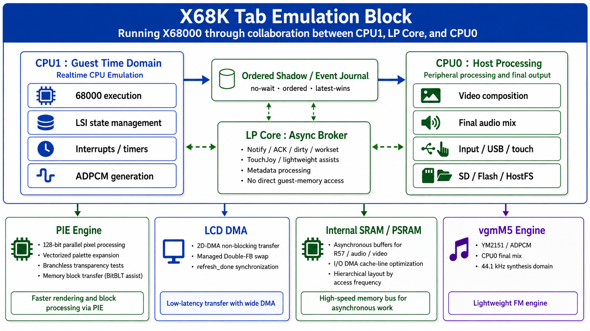

# X68K Tab

[**日本語 README → README.md**](README.md)

  

  <b>X68000 Emulator for M5Stack Tab5 / ESP32-P4</b> 
  Developed by Layer812 &nbsp;|&nbsp; Based on PX68K &nbsp;|&nbsp; 68000 core: Musashi

## About X68K Tab

**X68K Tab** is a portable X68000 emulator that runs on the M5Stack Tab5 (ESP32-P4).

Based on PX68K / Musashi, it has been redesigned to make use of the ESP32-P4's two HP CPUs, LP Core, PSRAM, MIPI-DSI, USB Host, microSD, and built-in audio.

The project originally started because I wanted to play old X68000 **PANIC** data on the M5Stack Tab5, so I first made the dedicated player [PanicPlayerTab5](https://github.com/Layer812/PanicPlayerTab5).

As I gradually implemented the X68000 environment needed to play PANIC... somehow it turned into an X68000 emulator.

This update integrates [**MidMod**](https://github.com/Layer812/MidMod), allowing X68000 MIDI output to be played through the [**M5Stack Unit Synth (SAM2695)**](https://www.switch-science.com/products/9510).

GS MIDI data is also converted using MidMod's GS → SAM2695 mapping so that it can be played as naturally as possible on the SAM2695.

> [!IMPORTANT]
> Complete compatibility with all X68000 software is not guaranteed.  
> If you find problems with display, audio, input, USB devices, disks, MIDI, or other functions, please open an Issue with steps to reproduce the problem.

---

## Current Production

The current Production build runs the **68000 guest CPU at 12 MHz, with the X68000 peripheral time domain at exact 10 MHz**.

The main update in this release is **MIDI / MidMod / SAM2695 support**.

### 2026-10-05 — Tab5 LCD panel compatibility update

M5Stack Tab5 units are known to exist with different LCD configurations depending on production period and hardware revision, including **ILI9881C, ST7121, and ST7123**.

The initial 2026-10-04 compatibility trial that only lowered the pixel clock to 60 MHz did not solve the reported display problem. Further testing separated panel detection, MIPI-DSI lane rate, pixel clock, porch timing, frame ACK/BTA behavior, clock-lane behavior, and panel initialization sequence. X68K Tab now applies panel-specific compatibility settings.

**An affected Tab5 equipped with ST7121 has now been confirmed to display and run X68K Tab correctly.** ST7123 keeps the known-good stable settings used by the reference unit, and an ILI9881C compatibility profile is also included.

These changes target physical LCD / MIPI-DSI initialization and scanout conditions only. The basic X68000 guest timing, CPU1, DoubleFB / PPA / presenter, MIDI, and audio policies are unchanged.

> [!NOTE]
> Operation on every Tab5 production batch cannot be guaranteed. If you encounter a display problem, please open an Issue with information about your Tab5 and the observed symptoms.
>
> **Special thanks to Nochi!** Thank you for testing on an ST7121-based Tab5 and confirming the LCD compatibility fix.

| Item | Production configuration |
| --- | --- |
| Guest CPU | **12 MHz** |
| Peripheral domain | **exact 10 MHz** |
| Guest RAM | **12 MiB** |
| CPU1 | Prioritizes 68000 / guest device time without waiting for host-side convenience |
| CPU0 | video / LCD / YM2151 / MIDI / final audio mix / USB / storage / host UI |
| Graphics | sparse dirty update |
| Audio | YM2151 + ADPCM |
| Storage | microSD / Flash / HostFS, XDF / DIM / HDS |
| Input | USB Keyboard / Joypad / Mouse + Touch UI |
| MIDI | **YM3802 → MidMod → M5Stack Unit Synth (SAM2695)** |
| GS | **MidMod GS → SAM2695 mapping** |
| PANIC | Integrated PANIC Player temporarily removed from the Production build |

---

## MIDI / MidMod / Unit Synth

This update adds support for X68000 MIDI output.

The MIDI processing library used is:

- [**MidMod — Modifiable MIDI Module**](https://github.com/Layer812/MidMod)

The sound module used is:

- [**M5Stack Unit Synth (SAM2695)**](https://www.switch-science.com/products/9510)

### GS mapping

The SAM2695 is not a Roland SC-55 / SC-88, so GS data cannot be reproduced with exactly the same sounds.

MidMod therefore uses GS → SAM2695 mapping with the basic idea:

> **"If this GS data were played on a SAM2695, which sound would be the most natural choice?"**

The mapping will continue to be improved on the MidMod side.

On X68K Tab, you can also place `/sdcard/midimap.csv` to replace the mapping profile.

---

## Quick Start — M5Burner

- [M5Burner official page](https://docs.m5stack.com/en/uiflow/m5burner/intro)
- [M5Stack downloads](https://docs.m5stack.com/en/download)

Enter the Share Code in **Share Burn** in M5Burner.

| Version | Share Code | Description |
| --- | --- | --- |
| **Latest / Production Release** | `soDETfCXCWpkWT37` | **Tab5 LCD compatibility + MidMod / SAM2695 MIDI support** |

Start with this build.

---

## Requirements

- [M5Stack Tab5](https://docs.m5stack.com/en/core/Tab5)
- microSD card
- Legally obtained X68000 software / disk images
  - FDD: `XDF`, `DIM`
  - HDD: `HDS`

### For MIDI

- [M5Stack Unit Synth (SAM2695)](https://www.switch-science.com/products/9510)

Connect it to X68K Tab PORT.A using MIDI at 31,250 bps.

### Input devices

- [M5Stack Tab5 Keyboard](https://www.switch-science.com/products/11257)
- USB keyboard
- USB Joypad / Gamepad
- USB mouse
- On-screen Touch UI / virtual keyboard / Joypad

---

## PANIC Player

X68K Tab started from the [PanicPlayerTab5](https://github.com/Layer812/PanicPlayerTab5) project.

However, I couldn't collect much PANIC data in the end (lol), so **the integrated PANIC Player has been temporarily removed from the Production build.**

PanicPlayerTab5 itself remains available as a separate project.

---

## Display / MULTISCAN

X68K Tab automatically detects **15 kHz / 24 kHz / 31 kHz class modes** from the guest CRTC state and converts them for display on the Tab5's 1280×720 LCD.

It does not output the original X68000 scan frequency externally. The Tab5 LCD uses a fixed output mode, and guest video modes are converted internally.

---

## Audio

YM2151 + ADPCM are reproduced on the ESP32-P4.

The design prioritizes keeping the guest timeline from being unnecessarily stopped by temporary host-side display load or similar host-side delays.

---

## ESP32-P4 Multi-Core Architecture

  

- **HP CPU1 — Guest Time Domain**  
  Prioritizes X68000-side time, including the 68000, interrupts, timers, guest-side DMA, CRTC, and audio events.

- **HP CPU0 — Host Processing**  
  Handles display composition, LCD, YM2151, MIDI, final audio mix, USB, SD / Flash / HostFS, and the Touch UI.

- **LP Core — Lightweight Broker**  
  Assists with selected lightweight notification / metadata / broker tasks.

The central principle is to **avoid unnecessarily stopping CPU1's guest timeline because of temporary host-side delays**.

---

## ROM / CGROM / Human68k

This repository does not include original SHARP X68000 ROM dumps, Human68k disk images, or user-owned X68000 software.

For CGROM, rather than redistributing an original CGROM dump, the repository provides `build_cgrom.py`.

Human68k-related files must also be obtained legally and used in accordance with the applicable terms.

See:

- `LICENSE_SHARP_X68000.txt`
- `LICENSE_PANIC_X.txt`
- `PANIC_V1.38_NOTICE.txt`
- `THIRD_PARTY_NOTICES.md`

---

## Source Build

Current Production baseline:

- ESP-IDF 5.5.x
- ESP32-P4 360 MHz
- PSRAM 32 MiB / 200 MHz
- Flash QIO / 80 MHz
- M5Unified / M5GFX
- Musashi
- PX68K
- [MidMod](https://github.com/Layer812/MidMod)

Do not add locally required ROMs, OS files, disk images, or similar files to the repository.

---

## Credits / License

X68K Tab is built on the work of many emulator projects, hardware research efforts, and open-source projects.

- PX68K
- Musashi
- vgmM5
- [MidMod](https://github.com/Layer812/MidMod)
- M5Stack / M5Unified / M5GFX
- Espressif ESP32-P4 / ESP-IDF

Please see the license and third-party notice files in the repository for details.

X68K Tab is an unofficial independent project and is not an official, endorsed, or sponsored product of SHARP, M5Stack, or any other rights holder.
